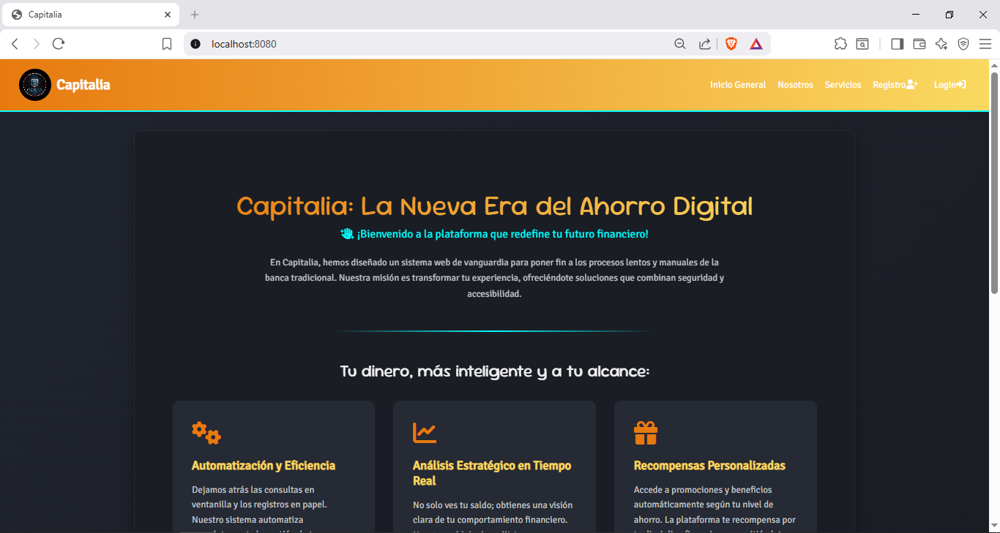
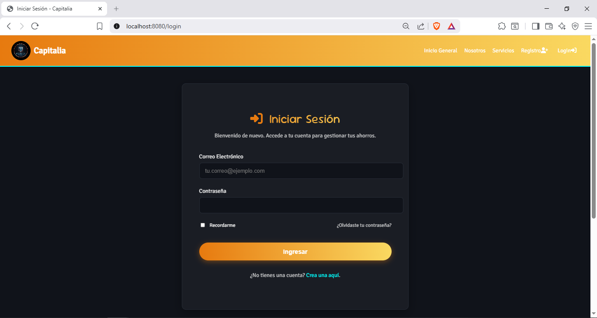
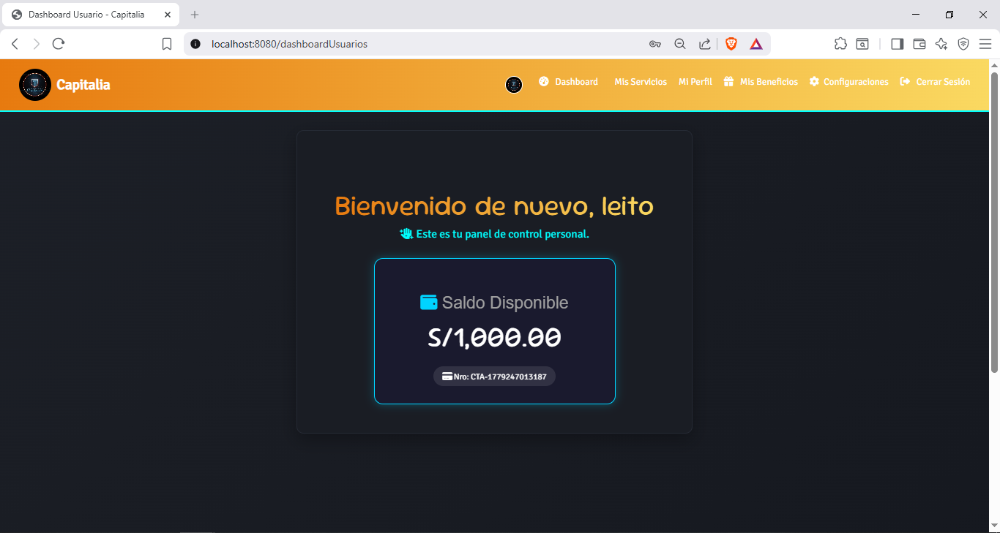
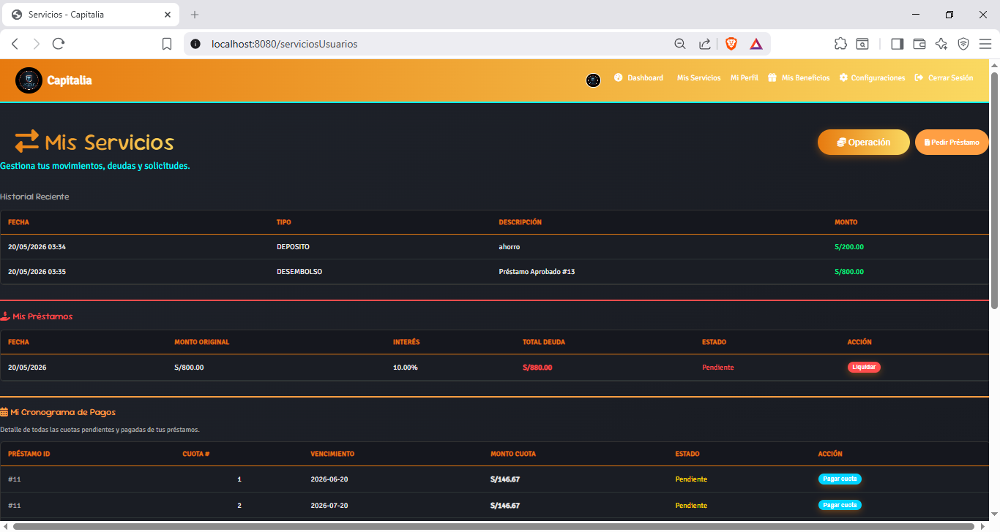
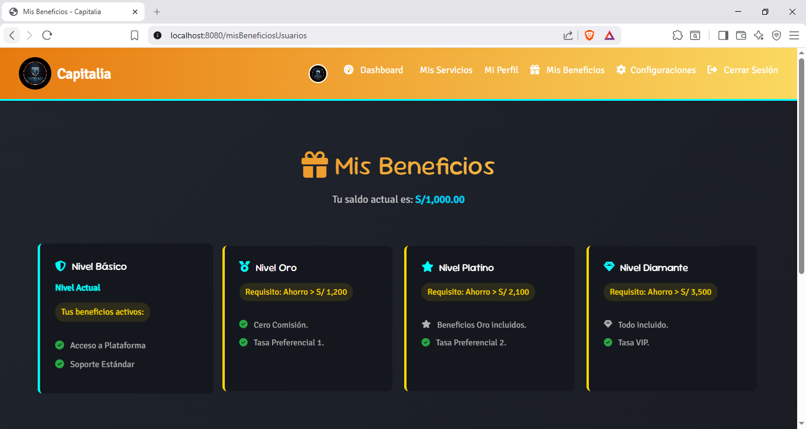
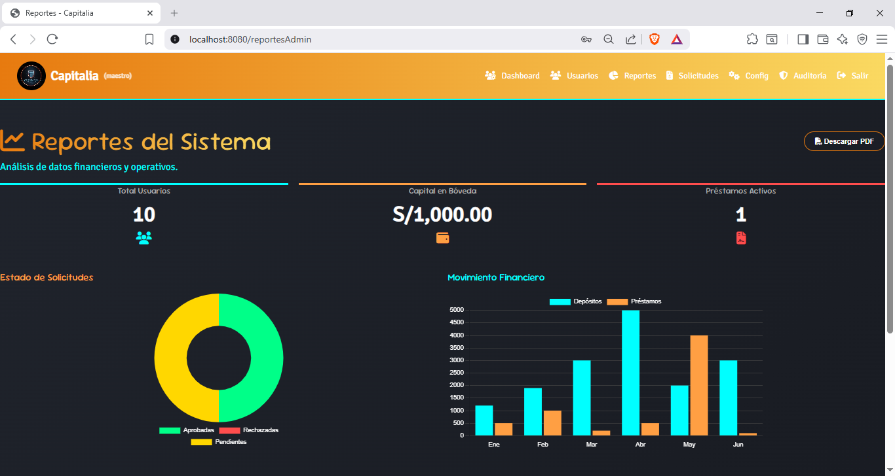
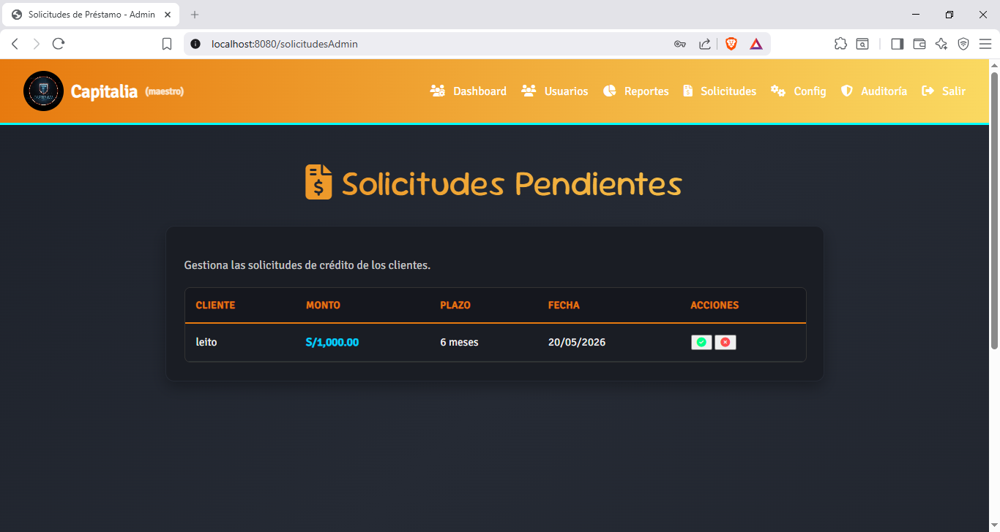

# Capitalia 🏦

Aplicación web bancaria/financiera desarrollada en Java con Spring Boot, como proyecto integrador de la Universidad Tecnológica del Perú (UTP).

## Vista previa

### Página de inicio


### Iniciar sesión


### Dashboard de usuario


### Mis servicios


### Mis beneficios


### Panel de reportes (Admin)


### Gestión de solicitudes (Admin)


## Funcionalidades

### Módulo de usuarios
- Registro con creación automática de cuenta bancaria
- Login con encriptación BCrypt y auto-migración de contraseñas planas
- Recuperación de contraseña por correo electrónico
- Gestión de perfil personal

### Módulo de préstamos
- Solicitud de préstamos con plazo configurable
- Aprobación/rechazo por administrador
- Desembolso automático al saldo del usuario
- Cronograma de pagos con cuotas mensuales
- Pago por cuota individual en orden
- Liquidación total del préstamo
- Tasa de interés dinámica configurable desde el panel admin

### Módulo de beneficios
- Niveles: Básico, Oro, Platino y Diamante
- Beneficios asignados automáticamente según saldo

### Panel de administración
- Gestión de usuarios y administradores
- Bandeja de solicitudes de préstamo
- Reportes con gráficos en tiempo real
- Configuración de parámetros del sistema
- Registro de auditoría (solo maestro)

## Tecnologías

| Capa | Tecnología |
|---|---|
| Backend | Java 21 + Spring Boot 4 |
| Frontend | Thymeleaf + HTML5 + CSS3 + JavaScript |
| Base de datos | MySQL |
| ORM | Hibernate / Spring Data JPA |
| Seguridad | Spring Security + BCrypt |
| Correo | Spring Mail + Gmail SMTP |
| Build | Maven |

## Arquitectura

El proyecto sigue una arquitectura N-Capas:

```
src/main/java/com/capitalia/
├── config/         # Configuración de seguridad
├── controller/     # Controladores MVC y REST
├── model/          # Entidades JPA
├── repository/     # Repositorios Spring Data
└── service/        # Lógica de negocio
```

## Requisitos previos

- Java 21
- MySQL (XAMPP recomendado)
- Maven

## Instalación

1. Clona el repositorio:
```bash
git clone https://github.com/piplop1/capitalia.git
```

2. Crea la base de datos en MySQL:
```sql
CREATE DATABASE capitalia;
```

3. Importa el esquema de tablas desde tu backup local.

4. Crea el archivo `src/main/resources/application-dev.properties` con tus credenciales:
```properties
spring.mail.host=smtp.gmail.com
spring.mail.port=587
spring.mail.username=TU_CORREO@gmail.com
spring.mail.password=TU_APP_PASSWORD
spring.mail.properties.mail.smtp.auth=true
spring.mail.properties.mail.smtp.starttls.enable=true
```

5. Ejecuta el proyecto desde IntelliJ o con:
```bash
./mvnw spring-boot:run
```

6. Abre el navegador en `http://localhost:8080`

## Roles del sistema

| Rol | Acceso |
|---|---|
| `usuario` | Dashboard, servicios, perfil, beneficios |
| `administrador` | Reportes, solicitudes, configuración |
| `maestro` | Acceso total incluyendo auditoría y gestión de admins |

## Equipo

Proyecto desarrollado bajo la metodología **Scrum** por:

- Jhanpool Correa — Scrum Master & Analista de Datos
- Leonardo Cueva — Product Owner & Desarrollador Backend
- José Periche — Arquitecto de Soluciones
- Luis Torres — Desarrollador Frontend & Tester

## Universidad

**Universidad Tecnológica del Perú (UTP)** — Lima, Perú
